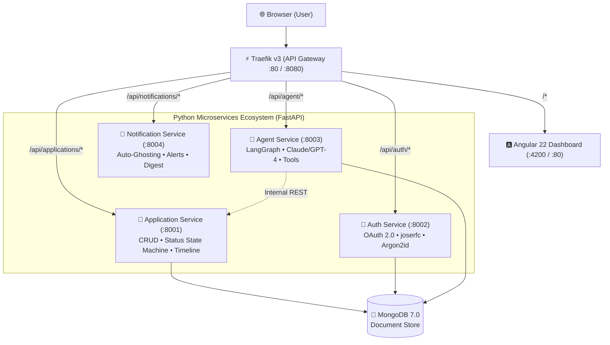

# CareerPilot — AI-Powered Job Search Automation Platform

> **End-to-End Autonomous Job Search & Application Intelligence Platform**  
> Architected as a modular, containerized Python microservices ecosystem with a reactive Angular frontend, LangGraph agent orchestration, and an asynchronous document store.

---

## 🏗️ System Architecture



---

## 🚀 Technology Stack (Industry Standards)

| Domain | Technology | Version | Purpose |
|---|---|---|---|
| **API Gateway** | Traefik | `v3.1+` | Docker-native dynamic routing via labels, dashboard on `:8080` |
| **Backend Framework** | FastAPI | `0.115+` | High-performance async microservices runtime |
| **Agent Orchestration** | LangGraph | `0.2+` | Stateful graph workflows for multi-step AI tasks |
| **Data Layer** | MongoDB + PyMongo Async + Beanie | `7.0` / `4.9+` / `2.0+` | Asynchronous ODM with native Pydantic v2 support |
| **Data Validation** | Pydantic v2 | `2.10+` | Rust-core schema validation shared across all services |
| **Frontend** | Angular | `19+` / `22` | Standalone components, Signals reactivity, SCSS |
| **UI Components** | Angular Material & CDK | `19+` / `22` | First-party Material 3 theme & DragDropModule |
| **Security & Auth** | joserfc & pwdlib[argon2] | `1.0+` / `0.2+` | Modern JOSE/JWT suite & OWASP Argon2id password hashing |
| **HTTP Client** | HTTPX | `0.28+` | Async HTTP client for external APIs & test runners |
| **Package Management**| Astral `uv` | `latest` | High-speed Rust-based Python workspace & dependency manager |
| **Code Quality** | Astral `ruff` | `latest` | Fast Python linter & formatter |
| **Containerization** | Docker & Compose v2 | `compose.yaml` | Multi-container local orchestration |

---

## 📦 Project Structure

```
├── compose.yaml                  # Docker Compose v2 configuration
├── .env.example                  # Environment variable blueprint
├── pyproject.toml                # Root uv workspace & ruff configuration
├── shared/                       # Shared Python package
│   ├── pyproject.toml
│   └── shared/
│       ├── schemas/              # Pydantic v2 models (Application, Resume, Prep, Profile)
│       ├── config.py             # Central BaseSettings
│       └── logging.py            # Structured JSON logging via structlog
│
├── services/
│   ├── application/              # Application Service (Step 1: FULL IMPLEMENTATION)
│   │   ├── app/
│   │   │   ├── main.py           # Lifespan, CORS, router mounts
│   │   │   ├── database.py       # Async PyMongo + Beanie initialization
│   │   │   ├── models/           # ApplicationDocument Beanie schema with indexes
│   │   │   ├── routes/           # REST endpoints (/api/applications)
│   │   │   └── services/         # ApplicationService business logic
│   │   └── tests/                # Pytest async test suite with mongomock
│   │
│   ├── auth/                     # Auth Service (Skeleton - Step 6)
│   ├── agent/                    # Agent Service (LangGraph workflow skeleton)
│   │   └── app/graph/            # StateGraph, typed state, and module node stubs
│   └── notification/             # Notification Service (Skeleton - Step 6)
│
└── frontend/                     # Angular Single Page Application
    ├── Dockerfile                # Multi-stage: Node build -> Nginx alpine
    ├── proxy.conf.json           # Local development proxy
    └── src/app/
        ├── core/                 # Models & ApplicationService with Angular Signals
        └── features/
            ├── dashboard/        # Pipeline analytics & overview
            └── kanban/           # CDK Drag & Drop Application Tracker
```

---

## 🗺️ Build Order & Roadmap

- [x] **Step 1: Application Tracker MVP & Angular Dashboard (Current)**
  - Full CRUD for applications in MongoDB via Beanie ODM.
  - Angular Kanban board with interactive Drag & Drop status updates.
  - Traefik API gateway routing and Docker Compose environment.
  - Shared Pydantic v2 domain schemas.
- [ ] **Step 2: Job Discovery Agent**
  - Connect legitimate job board APIs (Adzuna, RemoteOK, Greenhouse).
  - LLM relevance scoring against `EligibilityProfile`.
  - Automatic deduplication and ingestion into Application Service.
- [ ] **Step 3: Resume Personalization Agent**
  - Structured resume JSON transforms.
  - JD-targeted bullet re-ranking and skill alignment without hallucination.
- [ ] **Step 4: Interview & DSA Prep Agent**
  - Company & role interview question synthesis via Tavily search.
  - Categorized prep docs (Behavioral, Technical, System Design).
- [ ] **Step 5: GitHub Project Matcher**
  - PyGithub integration matching repository topics to job requirements.
- [ ] **Step 6: Notification Service & Auto-Ghosting**
  - Background APScheduler cron jobs for inactive applications (>14 days).
  - Calendar integration for scheduled interviews.

---

## ⚡ Getting Started Locally

### Option A: Run Entire Stack via Docker Compose (Recommended)

Make sure **Docker Desktop** is running:

```bash
# 1. Clone & enter repository
cd d:/Projects/Python/Job

# 2. Setup environment configuration
cp .env.example .env

# 3. Build and launch all containers
docker compose up --build
```

Access the services:
- **Angular Kanban UI**: [http://localhost](http://localhost) (or [http://localhost:4200](http://localhost:4200))
- **Traefik Dashboard**: [http://localhost:8080](http://localhost:8080)
- **Application Service OpenAPI**: [http://localhost/api/applications/docs](http://localhost/api/applications/docs)
- **Agent Service OpenAPI**: [http://localhost/api/agent/docs](http://localhost/api/agent/docs)

---

### Option B: Run Services Locally for Development

#### 1. Start MongoDB & Traefik
```bash
docker compose up mongodb traefik -d
```

#### 2. Run Application Service
```bash
cd services/application
python -m venv .venv
# On Windows:
.venv\Scripts\activate
# Install shared package & service:
pip install -e ../../shared -e .
uvicorn app.main:app --port 8001 --reload
```

#### 3. Run Frontend
```bash
cd frontend
npm install
npm start
```
Navigate to [http://localhost:4200](http://localhost:4200).

---

## 🧪 Testing

Run automated tests for the Application Service:

```bash
# Inside services/application with venv activated:
pip install -e ".[dev]"
pytest tests/ -v
```
