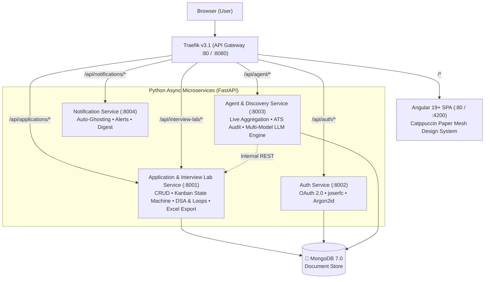

# CareerPilot — AI-Powered Job Search & Technical Interview Intelligence Platform

> **End-to-End Autonomous Job Search, Application Tracking & Technical Interview Lab**  
> Architected as a modular, containerized Python microservices ecosystem with a reactive Angular frontend, Beanie async ODM on MongoDB 7.0, multi-provider LLM integrations (Gemini, Claude, GPT-4o), and a tactile Catppuccin Paper Mesh design system.

---

##  System Architecture



---

## Key Features & Capabilities

### 1. Application Tracker (Kanban Board)
- **Interactive Drag & Drop**: Track jobs across 7 lifecycle stages (`Discovered`, `Applied`, `Responded`, `Interview`, `Offer`, `Rejected`, `Ghosted`).
- **Comprehensive Job Dossier**: Detailed modal with status tags, location, compensation, job links, and customizable application timelines.
- **Resume Parsing & AI Tailoring**: Attach PDF/TXT resumes and trigger AI keyword alignment, matched vs. missing skills analysis, and tailored experience bullet points with one-click clipboard copying.
- **Excel Export**: Download all tracked applications into a structured, styled `.xlsx` workbook.

### 2. Interview & Technical Knowledge Lab
- **Role-Linked Preparation**: Scope all questions, interview rounds, and flashcards directly to specific job applications.
- **Multi-Approach LeetCode & DSA Tracker**: Record multiple solution strategies (e.g. *Brute Force O(N²)* vs *Optimal Hash Map O(N)*), time/space complexity analysis, clean monospace code snippets, resource links, and custom taxonomy tags.
- **Interview Loop Experience Logger**: Construct multi-round interview pipelines (`R1: OA ➔ R2: Technical ➔ R3: System Design ➔ R4: Behavioral`), log candidate answers to specific interviewer questions, and rate performance (1-10 scale).
- **3D Interactive Flashcards Revision Deck**: Review technical concepts, system design tricks, and patterns in an interactive study deck with 3D flip card animations and keyboard navigation (`Space`, `←`, `→`, `Esc`).
- **Excel Export**: One-click download of all company-scoped DSA questions, interview loops, and flashcards into a multi-sheet spreadsheet.

### 3. 🔎 Live Job Search & Discovery Engine
- **Multi-Provider Ingestion**: Aggregate live listings from RemoteOK, Jooble, Adzuna, and Arbeitnow with query, country, and remote filters.
- **AI Fit Scoring**: Automatically evaluate job requirements against candidate skills and calculate percentage match scores.
- **One-Click Import**: Directly transfer discovered postings into the Kanban tracker.

### 4. 🎯 ATS & JD Match Scanner
- **ATS Pass Rate Audit**: Scan uploaded resumes or candidate bios against full job descriptions.
- **Role Alignment & Keyword Gaps**: Identify critical matched and missing keywords, hard skill requirements, and prioritized resume adjustments.

### 5. Multi-Model AI Engine & Live Diagnostics
- **Supported Providers**: Google Gemini (`gemini-2.5-flash`, `gemini-2.5-pro`), OpenAI (`gpt-4o`, `gpt-4o-mini`), Anthropic Claude (`claude-3-5-sonnet`), and GitHub PAT.
- **In-App Diagnostics Window**: Real-time ping test cards, latency meters (`⏱ ms`), and secure password show/hide visibility toggles.

### 6. Catppuccin Paper Mesh Design System
- **Dual Themes**: Catppuccin Latte (Light) and Catppuccin Mocha (Dark) with tactile paper mesh canvas backgrounds.
- **Clean Typography**: Carefully paired serif headers (`Lora`), clean modern body copy (`Plus Jakarta Sans`), and crisp code typography (`JetBrains Mono`).
- **Tactile UI**: Clean, solid, accessible buttons and cards with subtle paper elevation shadows.

---

## Technology Stack

| Domain | Technology | Version | Purpose |
|---|---|---|---|
| **API Gateway** | Traefik | `v3.1+` | Docker-native dynamic routing via labels, dashboard on `:8080` |
| **Backend Framework** | FastAPI | `0.115+` | High-performance async microservices runtime |
| **Data Layer** | MongoDB + PyMongo Async + Beanie | `7.0` / `4.9+` / `2.0+` | Asynchronous ODM with native Pydantic v2 support |
| **Data Validation** | Pydantic v2 | `2.10+` | Rust-core schema validation shared across all services |
| **Spreadsheet Engine** | openpyxl | `3.1+` | Formatted multi-sheet Excel workbook streaming |
| **LLM Integration** | Google GenAI SDK, OpenAI, Anthropic | `latest` | Multi-provider structured generative AI pipelines |
| **Frontend** | Angular | `19+` | Standalone components, Signal-based reactivity, SCSS |
| **UI & Interactions** | Angular CDK | `19+` | Drag & Drop lists, accessibility primitives |
| **HTTP Client** | HTTPX | `0.28+` | Async HTTP client for external integrations & tests |
| **Package Management**| Astral `uv` | `latest` | High-speed Rust-based Python workspace manager |
| **Code Quality** | Astral `ruff` | `latest` | Fast Python linter & formatter |
| **Containerization** | Docker & Compose v2 | `compose.yaml` | Multi-container local orchestration |

---

## Project Structure

```
├── compose.yaml                  # Docker Compose v2 stack definition
├── .env.example                  # Environment variable blueprint
├── pyproject.toml                # Root uv workspace & pytest configuration
├── shared/                       # Shared Python package
│   ├── pyproject.toml
│   └── shared/
│       ├── schemas/              # Pydantic v2 models (Application, InterviewLab, Resume, Profile)
│       ├── config.py             # Central BaseSettings
│       └── logging.py            # Structured logging
│
├── services/
│   ├── application/              # Application & Interview Lab Service
│   │   ├── app/
│   │   │   ├── main.py           # Lifespan, CORS, router mounts
│   │   │   ├── database.py       # Async PyMongo + Beanie initialization
│   │   │   ├── models/           # Beanie schemas (Application, Tag, Question, Experience, FlashCard)
│   │   │   ├── routes/           # REST endpoints (/api/applications, /api/interview-lab)
│   │   │   └── services/         # Business logic & openpyxl Excel exporters
│   │   └── tests/                # Pytest async test suite (12 test cases)
│   │
│   ├── agent/                    # Agent & Discovery Service
│   │   ├── app/
│   │   │   ├── main.py           # REST endpoints (/api/agent/discover, /api/agent/match-check, /api/agent/tailor-resume)
│   │   │   └── services/         # LLM providers & job aggregator clients
│   │   └── tests/
│   │
│   ├── auth/                     # Auth Service (OAuth 2.0 / JWT)
│   └── notification/             # Notification Service (Alerts & Reminders)
│
└── frontend/                     # Angular Single Page Application
    ├── Dockerfile                # Multi-stage: Node build -> Nginx alpine
    ├── proxy.conf.json           # Local dev reverse proxy
    └── src/app/
        ├── core/                 # Models & Services (ApplicationService, InterviewLabService, AgentService)
        └── features/
            ├── dashboard/        # Metrics & Pipeline Overview
            ├── kanban/           # Drag & Drop Application Tracker & Dossier Modal
            ├── discovery/        # Live Job Board Search & Fit Scoring
            ├── checker/          # ATS Resume vs JD Match Scanner
            └── interview/        # Role-Linked Interview Lab (Questions, Loops, Flashcards)
```

---

## Quick Start

### Option A: Run Full Stack via Docker Compose (Recommended)

Ensure **Docker Desktop** is running:

```bash
# 1. Clone & enter repository
git clone https://github.com/Rushilch/Job-Tracker.git
cd Job-Tracker

# 2. Configure environment variables
cp .env.example .env

# 3. Build and launch all services
docker compose up --build -d
```

#### Service URLs:
- **Web App**: [http://localhost](http://localhost)
- **Traefik Dashboard**: [http://localhost:8080](http://localhost:8080)
- **Application & Interview Lab API Docs**: [http://localhost/api/applications/docs](http://localhost/api/applications/docs)
- **Agent & Discovery API Docs**: [http://localhost/api/agent/docs](http://localhost/api/agent/docs)

---

### Option B: Local Development Setup

#### 1. Start Infrastructure (MongoDB & Traefik)
```bash
docker compose up mongodb traefik -d
```

#### 2. Run Application Service
```bash
cd services/application
python -m venv .venv
.venv\Scripts\activate            # Windows (.venv/bin/activate on Linux/macOS)
pip install -e ../../shared -e .
uvicorn app.main:app --port 8001 --reload
```

#### 3. Run Agent Service
```bash
cd services/agent
python -m venv .venv
.venv\Scripts\activate
pip install -e ../../shared -e .
uvicorn app.main:app --port 8003 --reload
```

#### 4. Run Angular Frontend
```bash
cd frontend
npm install
npm start
```
Navigate to [http://localhost:4200](http://localhost:4200).

---

## Testing

Run backend automated tests from the repository root:

```bash
# Run all application & interview lab tests:
.venv\Scripts\python.exe -m pytest services/application/tests

# Run frontend production build verification:
cd frontend
npm run build
```

---

## 📄 License
MIT License © 2026 CareerPilot Contributors.

